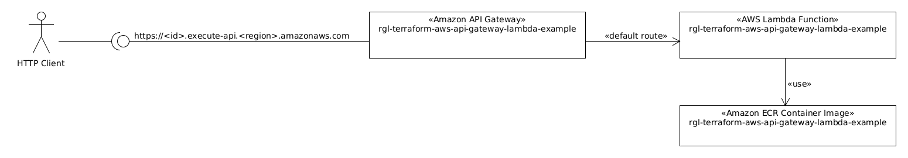

# About

[](https://github.com/rgl/terraform-aws-api-gateway-lambda-example/actions/workflows/lint.yml)

This deploys an example [Amazon API Gateway](https://aws.amazon.com/api-gateway/) and [AWS Lambda Function](https://aws.amazon.com/lambda/).

The following components are used:



This will:

* Build an example Go AWS Lambda Function as a Container Image.
  * Upload it to the [Amazon ECR](https://aws.amazon.com/ecr/).
* Create an [Amazon API Gateway](https://aws.amazon.com/api-gateway/).
  * Configure the Go AWS Lambda Function as its default route.

# Usage (on a Ubuntu Desktop)

Install the dependencies:

* [AWS CLI](https://docs.aws.amazon.com/cli/latest/userguide/getting-started-install.html).
* [Terraform](https://www.terraform.io/downloads.html).
* [Docker](https://docs.docker.com/engine/install/).

Set the AWS Account credentials using SSO:

```bash
# set the environment variables to use a specific profile.
# e.g. use the pattern <aws-sso-session-name>-<aws-account-name>-<aws-account-role>-<aws-account-id>
export AWS_PROFILE=example-dev-AdministratorAccess-123456
unset AWS_ACCESS_KEY_ID
unset AWS_SECRET_ACCESS_KEY
unset AWS_DEFAULT_REGION
# set the account credentials.
# see https://docs.aws.amazon.com/cli/latest/userguide/sso-configure-profile-token.html#sso-configure-profile-token-auto-sso
aws configure sso
# dump the configured profile and sso-session.
cat ~/.aws/config
# show the user, user amazon resource name (arn), and the account id, of the
# profile set in the AWS_PROFILE environment variable.
aws sts get-caller-identity
```

Or, set the AWS Account credentials using an Access Key:

```bash
# set the account credentials.
# NB get these from your aws account iam console.
#    see Managing access keys (console) at
#        https://docs.aws.amazon.com/IAM/latest/UserGuide/id_credentials_access-keys.html#Using_CreateAccessKey
export AWS_ACCESS_KEY_ID='TODO'
export AWS_SECRET_ACCESS_KEY='TODO'
unset AWS_PROFILE
# set the default region.
export AWS_DEFAULT_REGION='eu-west-1'
# show the user, user amazon resource name (arn), and the account id.
aws sts get-caller-identity
```

Review the [`inputs.tf`](inputs.tf) file.

Initialize the project:

```bash
terraform init -lockfile=readonly
```

Deploy the example:

```bash
terraform apply
```

Show the terraform state:

```bash
terraform state list
terraform show
```

Access the example:

```bash
example_url="$(terraform output --raw example_url)"
wget -qO- "$example_url" | jq
```

Destroy the example:

```bash
terraform destroy
```

List this repository dependencies (and which have newer versions):

```bash
GITHUB_COM_TOKEN='YOUR_GITHUB_PERSONAL_TOKEN' ./renovate.sh
```
